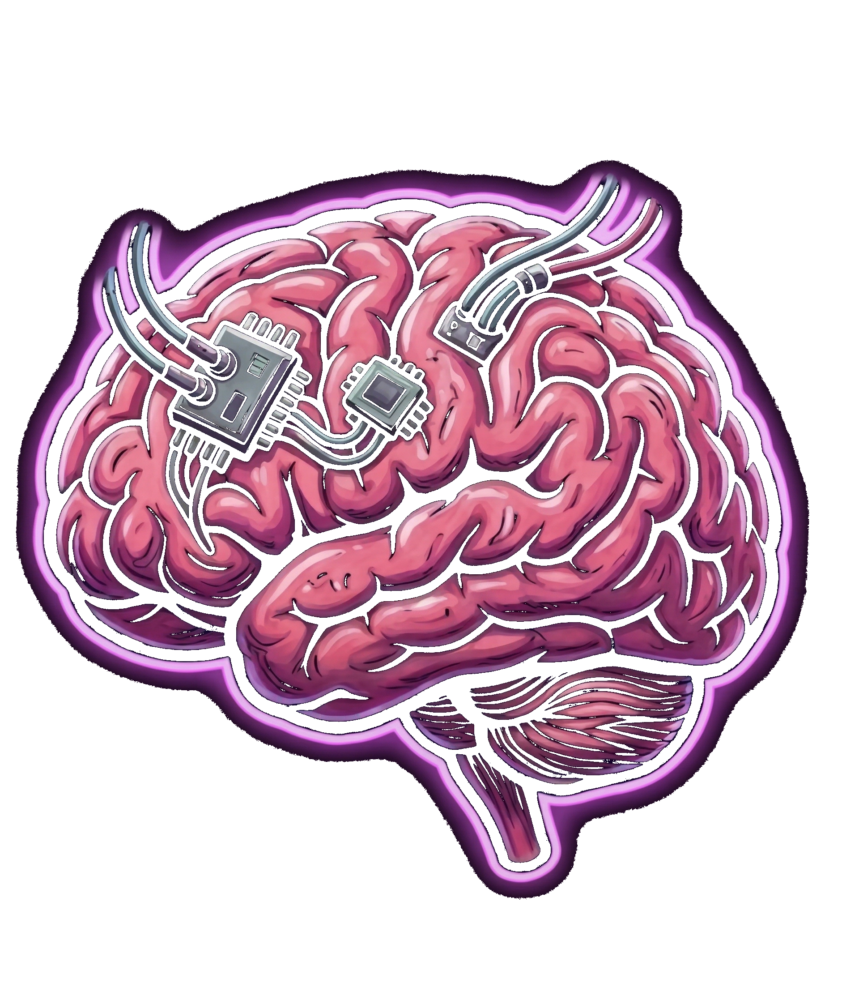
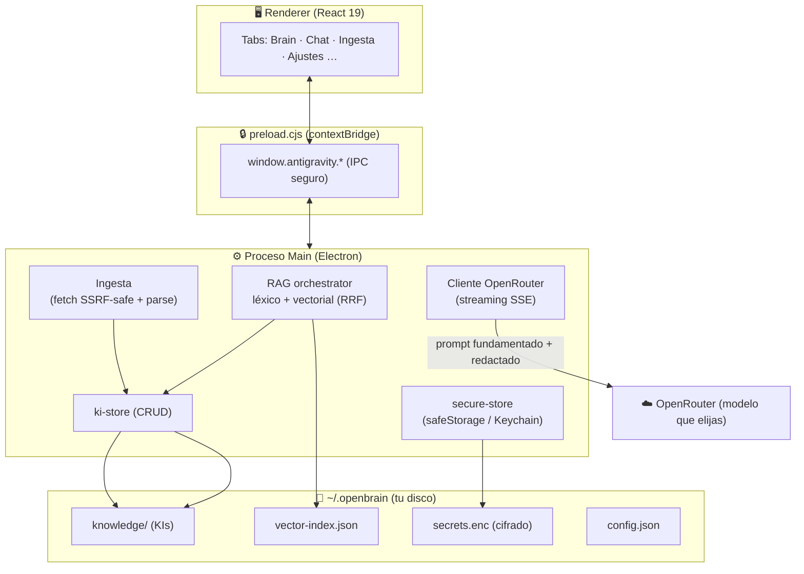
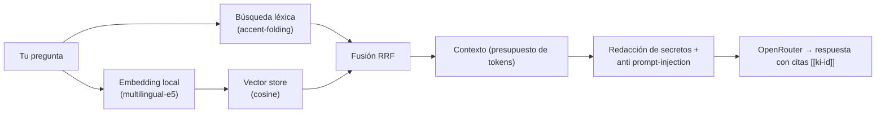

<div align="center">



# 🧠 Open Brain

### Tu segundo cerebro con IA — RAG conversacional sobre tu propio conocimiento, local-first

Habla con tus **400+ Knowledge Items** como si fueran una persona. Búsqueda **semántica local**, chat con streaming vía **OpenRouter**, e ingesta de **webs y documentos** — todo desde una app de escritorio con estética Neural OS, sin que tus datos vivan en la nube de nadie.

<br/>

[](#)
[](#-instalación)
[](https://react.dev/)
[](https://openrouter.ai/)
[](#-cómo-funciona-el-rag)
[](#-licencia)

</div>

---

## ✨ Qué es

**Open Brain** es una aplicación de escritorio (Electron + React) que convierte tu conocimiento acumulado en un **asistente conversacional fundamentado**. Guarda tus notas técnicas, auditorías, decisiones y aprendizajes como *Knowledge Items* (KIs) y luego **chateas con ellos**: la IA recupera los fragmentos relevantes, responde citando las fuentes, y aprende de lo que le vas subiendo.

El principio rector es la **privacidad**: la recuperación (búsqueda + embeddings) ocurre **entera en tu máquina**; solo el prompt final va al modelo de OpenRouter que tú elijas — y aun así, con los secretos redactados antes de salir.

## 🚀 Capacidades

| Pestaña | Qué hace |
|---|---|
| 🧠 **Brain** | Explora, crea y gestiona tus Knowledge Items (KIs). |
| 💬 **Chat** | Chat con **streaming** fundamentado en tu Brain (RAG). Cita fuentes `[[ki-id]]` clicables, selector de modelo, saldo en vivo, y botón *Guardar en Brain*. |
| 📥 **Ingesta** | Pega una **URL** → extrae, resume con IA y guarda como KI. Arrastra **PDF / DOCX / TXT / MD** → se convierten en KIs indexados. |
| 🔌 **MCP** | Servidor MCP que expone tus KIs a Claude, Antigravity u otros agentes. |
| 🖥️ **Servidores** | Estado en vivo de tus VPS y servicios. |
| 🔑 **APIs** | Panel de APIs con saldos y alertas — **keys cifradas**, nunca en claro. |
| ⚙️ **Ajustes** | Configura OpenRouter (key cifrada en Keychain), modelo, privacidad, y reindexado semántico. |

## 🏗️ Arquitectura



## 🔍 Cómo funciona el RAG

El chat no "alucina" sobre tu conocimiento: lo **recupera de verdad**.



- **Híbrido**: combina coincidencia léxica (con plegado de acentos, para que *"auditoria"* encuentre *"Auditoría"*) y **similitud semántica** (encuentra *"proteger el servidor"* aunque el KI diga *"hardening"*).
- **Embeddings 100% locales** con `@xenova/transformers` (WASM, modelo multilingüe) — sin módulos nativos, sin `sqlite-vec`: un simple índice JSON + cosine, instantáneo a esta escala.
- **Citas verificadas**: solo se aceptan `[[id]]` que correspondan a KIs realmente enviados al modelo.

## 🛡️ Privacidad y seguridad

Diseñado con honestidad, no con humo:

- 🔐 **Keys cifradas en el Keychain de macOS** (`safeStorage`). El renderer **nunca** ve una API key; `ag:get-apis` devuelve solo máscara + `hasKey`.
- 🧠 **Recuperación local**: la búsqueda y los embeddings no salen de tu Mac. Solo el prompt final fundamentado se envía al modelo que elijas.
- ✂️ **Redacción de secretos** salientes: keys, tokens, JWT y emails se enmascaran antes de ir a la nube (configurable).
- 🧱 **Anti prompt-injection**: el contexto de tus KIs se envuelve en `<contexto_brain>` con instrucción de tratarlo como datos, nunca como órdenes.
- 🌐 **Ingesta con guarda anti-SSRF**: bloquea IPs privadas, loopback, link-local y endpoints de metadata cloud; valida cada redirect.
- 📦 **DMG vacío garantizado**: un guard de build aborta el empaquetado si detecta KIs, keys o datos personales. Tu vault vive siempre en `~/.openbrain`, jamás dentro del `.app`.
- 🪝 **Pre-commit secret-scan**: un hook de git bloquea commits que contengan secretos.

> **Nota honesta:** el chat usa un LLM en la nube (OpenRouter), así que el *prompt fundamentado* sí sale de tu máquina (minimizado y redactado). Para cero-nube, activa el modo *solo-local* en Ajustes (recuperación sin generación).

## 📦 Instalación

Requisitos: **Node 20+**, macOS Apple Silicon (para el `.dmg`; el core corre en cualquier plataforma Electron).

```bash
git clone https://github.com/KrilinZ/open-brain.git
cd open-brain
npm install

# Desarrollo (Vite + Electron con hot-reload)
npm run app:dev

# Empaquetar la app de escritorio (.app + .dmg, Apple Silicon)
npm run app:build
```

Al primer arranque, un onboarding te pide tu **API key de OpenRouter** (se guarda cifrada). Consíguela en [openrouter.ai/keys](https://openrouter.ai/keys).

## ⚙️ Configuración

Todo se gestiona desde la pestaña **Ajustes** (nada de editar JSON a mano):

- **OpenRouter**: key (cifrada), modelo por defecto (`openai/gpt-4o-mini` recomendado para no drenar saldo), y prueba de conexión con saldo en vivo.
- **Privacidad**: toggles de *solo-local*, *enviar contexto de KIs*, *redactar secretos*.
- **Búsqueda semántica**: botón **Reindexar** con barra de progreso (construye/actualiza el índice de embeddings local).

## 🗂️ Estructura del proyecto

```
main.js                 # Proceso main de Electron (IPC handlers)
preload.cjs             # Puente seguro renderer ↔ main
main/                   # secure-store (Keychain) · config-store
lib/
  ├─ openrouter-chat.mjs   # Cliente OpenRouter (streaming SSE, 0 deps)
  ├─ ki-store.mjs          # CRUD canónico de KIs
  ├─ rag/                  # normalize · chunk · retriever · embedder ·
  │                        # vector-store · orchestrator · vector-index
  └─ ingest/               # fetcher (anti-SSRF) · extract · doc-parse
scripts/                # mcp-ki-server · ki-reconcile · verify-clean-build · secret-scan
src/                    # React 19 + Tailwind + framer-motion
  └─ components/tabs/    # TabBrainChat · TabIngesta · TabConfig · …
~/.openbrain/           # 📁 Tu vault (KIs, índice, config, secrets.enc) — fuera del repo
```

## 🔌 Herramientas CLI

```bash
npm run ki:mcp            # Servidor MCP (expone tus KIs a Claude/Antigravity)
npm run ki:reconcile      # Reconcilia/unifica stores de KIs (dry-run)
npm run verify:clean      # Comprueba que ningún dato sensible se colaría en el DMG
```

## 🧰 Stack

**Electron 41** · **React 19** · **Vite** · **TailwindCSS** · **framer-motion** · **OpenRouter** (LLM) · **@xenova/transformers** (embeddings locales, WASM) · **Readability + Turndown + pdf-parse + mammoth** (ingesta) · **MCP** (JSON-RPC).

## 🗺️ Estado

Todas las fases del roadmap están hechas y verificadas:

- ✅ Rescate y unificación de KIs (single source of truth)
- ✅ Cimiento: seguridad + config + DMG vacío
- ✅ Motor de chat OpenRouter (streaming)
- ✅ Brain Chat (MVP conversacional)
- ✅ RAG con citas y *Guardar en Brain*
- ✅ Búsqueda semántica local (embeddings)
- ✅ Ingesta web + documentos

## 📄 Licencia

MIT © Nacho López ([KrilinZ](https://github.com/KrilinZ))

<div align="center">
<br/>
<sub>Construido con obsesión por la privacidad y el conocimiento que no se pierde. 🧠</sub>
</div>
